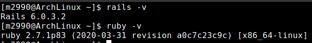

# rails_arch_linux

This is a back up of the installation process used to get Ruby on Rails properly running on a Arch Linux set up.

# Install ruby

To install ruby you need to use pacman. 

    $ pacman -S ruby --noconfirm

# Install rails

To install Rails you have an AUR pkg and the gem method. For this I used to gem install which i recommend just remember they don't auto update like AUR does.

    gem install rails

    #then update your installed ruby gems in dir
    
    gem update

# Allow Ruby Gems

Add a .profile file to ~/.profile with the following line of code.

    PATH="$PATH:$(ruby -e 'puts Gem.user_dir')/bin"

# Link RubyGems/Rails dir to $PATH

Open your terminal and execute the following command. 
Replace 'YOUR_HOME_DIR' with the name of your home folder. This will help bash see where Rails is.

    #You need sudo to access the etc folder with write premissions

    sudo nano /etc/profile

    #Add the following in your /etc/profile file and save+exit

    export PATH="/home/YOUR_HOME_DIR/.gem/ruby/2.7.0/bin:$PATH"

# Test Rails and Ruby

You should now be able to use rails and start your awesome projects. Type in your terminal the following and it should out put your versions. 

    ruby -v

    rails -v

# Notice

This is the process I followed to get ruby installed on my arch system. I share with you as i ran into issues and found no solutions on google. Your mileage may vary.

## Authors

👤 **Miguel Angel Enciso Sanchez**

- Github: [@rootDEV2990](https://github.com/rootDEV2990)
- Twitter: [@m29902](https://twitter.com/m29902)
- Linkedin: [linkedin](https://www.linkedin.com/in/miguel-enciso-6474741a1/)
- Medium: [medium](https://medium.com/@website.dev)

## 🤝 Contributing

Contributions, issues and feature requests are welcome!

Feel free to check the [issues page](issues/).

## Show your support

Give a ⭐️ if you like this project!

Bitcoin donations accepted ;)

1AD5ANtHmqemTZ2Qmv5UqJAMijTNyCAH8D 🚀
